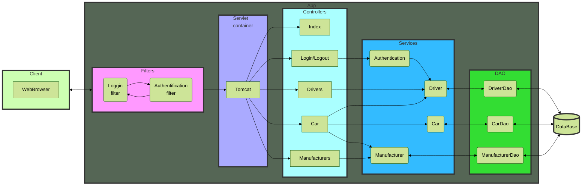
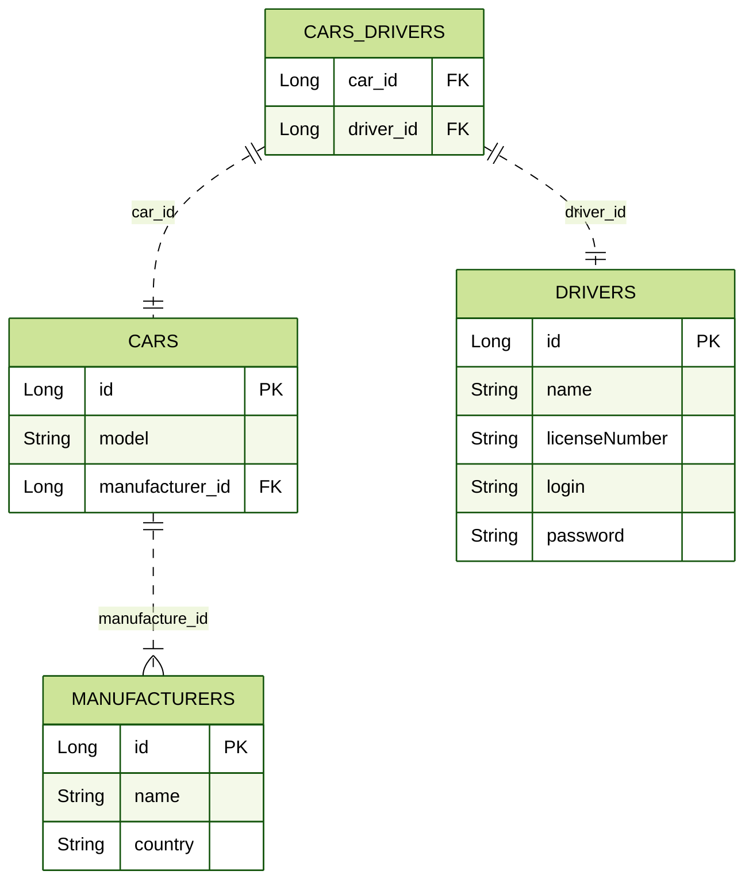

# Car'n'Driver service &middot;
[](https://travis-ci.org/npm/npm) [](https://www.npmjs.com/package/npm) [](http://makeapullrequest.com) [](https://github.com/your/your-project/blob/master/LICENSE)
> Additional information or tag line

A brief description of your project, what it is used for.

## Installing / Getting started

A quick introduction of the minimal setup you need to get a hello world up &
running.

```shell
commands here
```

Here you should say what actually happens when you execute the code above.

## Developing

### Diagram of application



### Database diagram



### Prerequisites

### Built With
Application was built with:
- JDBC
- Maven

### Setting up Dev

To start developing the project further:

```shell
git clone https://github.com/Oleksii-Mospan/hw-jv-web-security.git
cd hw-jv-web-security/
packagemanager install
```

Also, you need to configure local server. I'd use Tomcat 9.0.50 server.
If you use IntelliJ IDEA here is good step-by-step tutorial: https://youtu.be/JIRDMGJ66SE.

To configure tables in DataBase:
1. Open file [init_db.sql](https://github.com/Oleksii-Mospan/hw-jv-web-security/blob/main/src/main/resources/init_db.sql)
2. Copy the contents of the file
3. Paste it to new SQL query tab in Workbench (or hosting for MySQL database)
4. Run it

To configure connection of project to database fill free to use edit ConnectionUtil.java (src/main/java/taxi/util/ConnectionUtil.java):
>private static final String URL = "jdbc:mysql://<URL_TO_DATABASE>:<PORT>/<DATABASE_NAME>?serverTimezone=UTC";
>private static final String USERNAME = "<DATABASE_USERNAME>";
>private static final String PASSWORD = "<DATABASE_PASSWORD>";
>private static final String JDBC_DRIVER = "com.mysql.cj.jdbc.Driver";

Just create SQL query and copy all from [init_db.sql](https://github.com/Oleksii-Mospan/hw-jv-web-security/blob/main/src/main/resources/init_db.sql)

### Building

If your project needs some additional steps for the developer to build the
project after some code changes, state them here. for example:

```shell
./configure
make
make install
```

Here again you should state what actually happens when the code above gets
executed.

### Deploying / Publishing
give instructions on how to build and release a new version
In case there's some step you have to take that publishes this project to a
server, this is the right time to state it.

```shell
packagemanager deploy your-project -s server.com -u username -p password
```

And again you'd need to tell what the previous code actually does.

## Versioning

We can maybe use [SemVer](http://semver.org/) for versioning. For the versions available, see the [link to tags on this repository](/tags).


## Configuration

Here you should write what are all of the configurations a user can enter when using the project.

## Tests

Describe and show how to run the tests with code examples.
Explain what these tests test and why.

```shell
Give an example
```

## Style guide

Explain your code style and show how to check it.

## Api Reference

If the api is external, link to api documentation. If not describe your api including authentication methods as well as explaining all the endpoints with their required parameters.


## Database

Explaining what database (and version) has been used. Provide download links.
Documents your database design and schemas, relations etc...

## Licensing

State what the license is and how to find the text version of the license.
# This is an educational project.
Main topic: create web application and publish it to Internet.

Main function of project:
- Login and logout as driver
- Display all drivers and cars from database
- Display connection between cars and drivers (driver can rule more than one car)
- Display only car, which login driver rules
- Adding and deleting cars, drivers and manufacturers
- "Sitting" driver to car

__You can try my application here__ [click](https://fast-mountain-11243.herokuapp.com)


Some features I learned while programming this project:
- Configuring MySQL database (queries, creation of tables, types of fields, etc.).
- Working with JDBC and MySQL database.
- Configuring servlets and controllers.
- Implementation of simple Authorization by login and password.
- Project built with SOLID principles.
- Using Session to store some information.
- Using filters to show only permitted pages.
- Using Dependency Injection for creating instances.

# Deploying project
Deploying project was able by publication web application to the PaaS heroku.com
Database was created on free service freemysqlhosting.net

