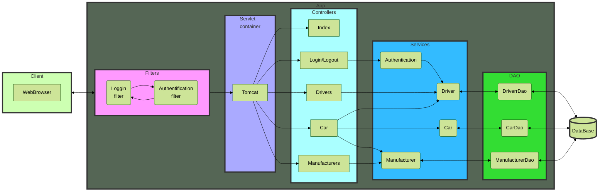
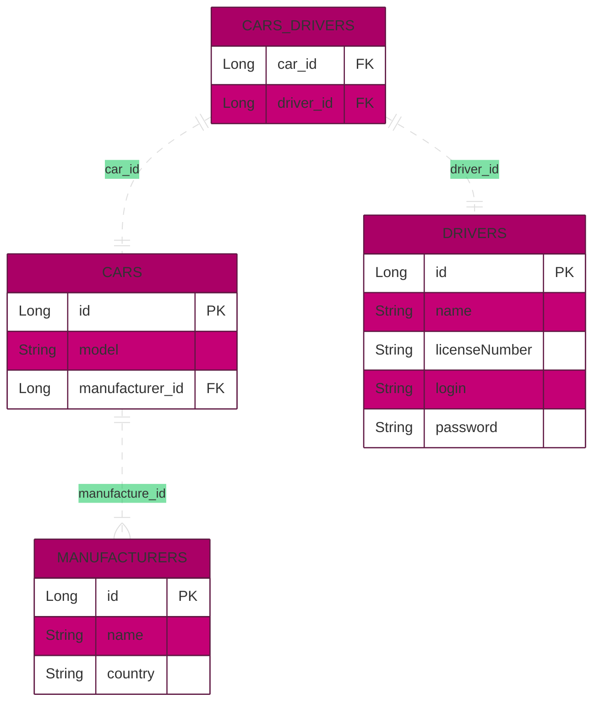

# Car'n'Driver service &middot;
[](https://semver.org)

This app is used for manage cars autopark with known drivers.
This is prototype of web application that represents taxi service. It consists of backend and 
frontend parts, and implemented using n-tired architecture and compliance with SOLID. 

#### It supports such functionality as:
- Registration new user as driver
- Login with driver login and password or logout to log in with another driver
- Adding new cars, drivers and manufacturers
- Set driver to needed car
- Open list of all cars with list of drivers
- Open list of cars for current/login driver
- Delete car, driver or manufacturer

__You can try my application here__ [click](https://fast-mountain-11243.herokuapp.com)

## Developing

### Diagram of application



### Technologies used:
- JDBC
- MySQL 8
- Servlet
- JSP
- JSTL
- Tomcat 9
- Maven
- Log4j2
- CSS

### Running project on local machine

- Clone this project into your local folder 
- Open the project in an IDE
- Install and configure Local Tomcat Server (set "/" in Deployment tab - car-n-driver:war exploded)
- After run the application you need to create new driver by clicking to Drivers
- Then you can log in by entering login and password
- create a new driver by clicking on the "Registration" button.
#### Setting up local DataBase
- Download and install MySQL, Workbench
- Copy and paste file [init_db.sql](https://github.com/Oleksii-Mospan/Car-n-Driver/blob/main/src/main/resources/init_db.sql) from resources folder to Workbench console and execute code there
- To configure connection of project to database fill free to edit ConnectionUtil.java (src/main/java/taxi/util/ConnectionUtil.java)

```java
private static final String URL = "jdbc:mysql://<URL_TO_DATABASE>/<DATABASE_NAME>?serverTimezone=UTC";
private static final String USERNAME = "<DATABASE_USERNAME>";
private static final String PASSWORD = "<DATABASE_PASSWORD>";
private static final String JDBC_DRIVER = "com.mysql.cj.jdbc.Driver";
```
#### where:
<URL_TO_DATABASE> - URL to Database (for example: localhost) <br>
<DATABASE_NAME> - name of database(for example: cars_n_drivers) <br>
<DATABASE_USERNAME> - username to get permission to read and write to database <br>
<DATABASE_PASSWORD - password for \<DATABASE_USERNAME> user <br>

Also, you need to configure local server. I'd use Tomcat 9.0.50 server.
If you use IntelliJ IDEA here is good step-by-step tutorial: https://youtu.be/JIRDMGJ66SE.

### Database diagram



# P.S.
Some features I learned while programming this project:
- Configuring MySQL database (queries, creation of tables, types of fields, etc.).
- Working with JDBC and MySQL database.
- Configuring servlets and controllers.
- Implementation of simple Authorization by login and password.
- Project built with SOLID principles.
- Using Session to store some information.
- Using filters to show only permitted pages.
- Using Dependency Injection for creating instances.
- Creating README.md file.
- Creating diagrams using [mermaid](https://mermaid-js.github.io/mermaid/#/) tool.  

