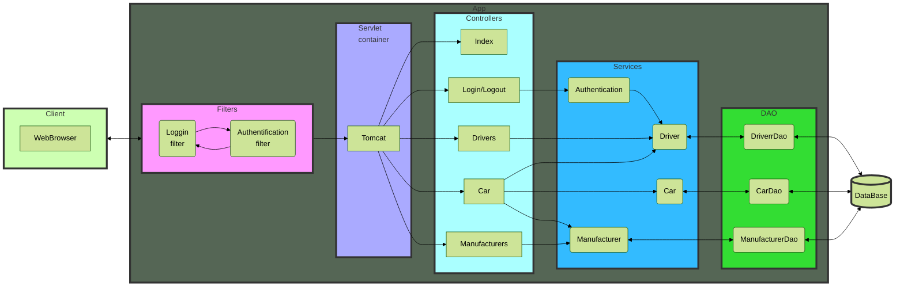
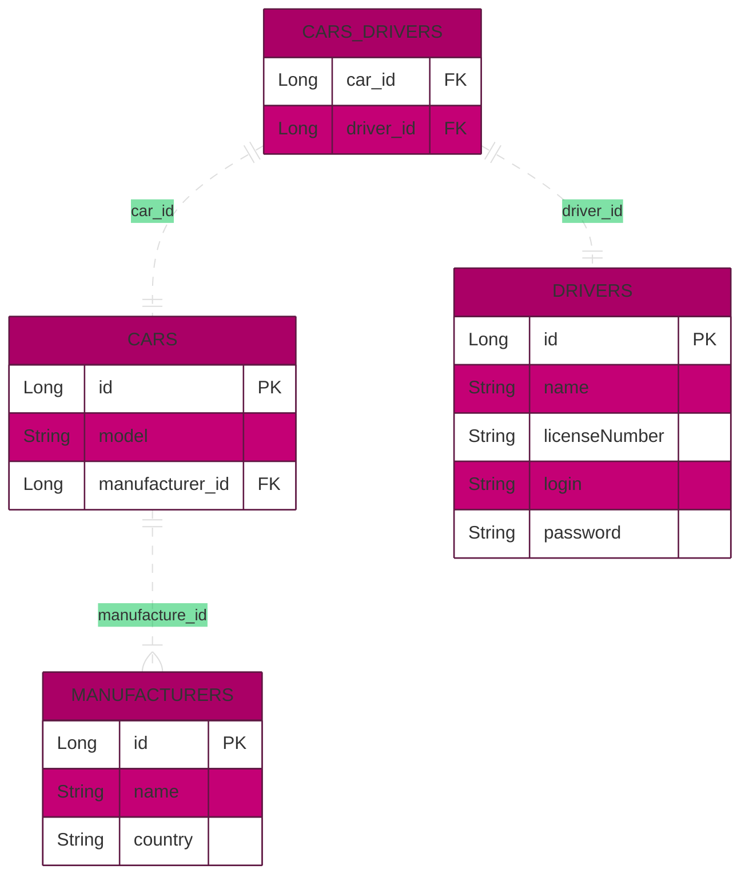

# Car'n'Driver service &middot;
[](https://semver.org)

This app is used for manage cars autopark with known drivers.

__You can try my application here__ [click](https://fast-mountain-11243.herokuapp.com)

#### What you can do in the app:
- Create new cars, drivers and manufacturers
- Set driver to needed car
- Open list of all cars with list of drivers
- Open list of cars for current/login driver
- Delete car, driver or manufacturer
- Logout to login with another driver

## Installing
To install project:
1. Compile project
2. Push it to WebServer or download to any PaaS using its own instruction/tutorial
3. Open page of your new application
4. Enjoy

## Getting started
After run app (open page of web application) you will be redirected to login page. 
On login page you must use known login and password, or you can create new driver by pressing 
link to Driver page. 

## Developing

### Diagram of application



### Prerequisites

### Built With
Application was built with:
- JDBC
- Maven

### Setting up Dev

To start developing the project further:

```shell
git clone https://github.com/Oleksii-Mospan/hw-jv-web-security.git
cd hw-jv-web-security/
packagemanager install
```

Also, you need to configure local server. I'd use Tomcat 9.0.50 server.
If you use IntelliJ IDEA here is good step-by-step tutorial: https://youtu.be/JIRDMGJ66SE.

To configure connection of project to database fill free to edit ConnectionUtil.java (src/main/java/taxi/util/ConnectionUtil.java)

```java
private static final String URL = "jdbc:mysql://<URL_TO_DATABASE>:<PORT>/<DATABASE_NAME>?serverTimezone=UTC";
private static final String USERNAME = "<DATABASE_USERNAME>";
private static final String PASSWORD = "<DATABASE_PASSWORD>";
private static final String JDBC_DRIVER = "com.mysql.cj.jdbc.Driver";
```
#### where:
- \<URL_TO_DATABASE> - URL to Database (for example: sql11.freemysqlhosting.net)
- \<PORT> - port number of database (for example: 3306)
- \<DATABASE_NAME> - name of database(for example: sql11510452)
- \<DATABASE_USERNAME> - username to get permission to read and write to database
- \<DATABASE_PASSWORD - password for \<DATABASE_USERNAME> user

Just create SQL query and copy all from [init_db.sql](https://github.com/Oleksii-Mospan/hw-jv-web-security/blob/main/src/main/resources/init_db.sql)

## Tests

For now tests is under construction...

## Database

In this project we use MySQL database.

### To configure tables in DataBase:
1. Open file [init_db.sql](https://github.com/Oleksii-Mospan/hw-jv-web-security/blob/main/src/main/resources/init_db.sql)
2. Copy the contents of the file
3. Paste it to new SQL query tab in Workbench (or hosting for MySQL database)
4. Run it

### Database diagram




## Licensing

This is a free project and was used to learn mechanism of creation web application 
and publish it to Internet.

# P.S.
Some features I learned while programming this project:
- Configuring MySQL database (queries, creation of tables, types of fields, etc.).
- Working with JDBC and MySQL database.
- Configuring servlets and controllers.
- Implementation of simple Authorization by login and password.
- Project built with SOLID principles.
- Using Session to store some information.
- Using filters to show only permitted pages.
- Using Dependency Injection for creating instances.
- Creating README.md file.
- Creating diagrams using [mermaid](https://mermaid-js.github.io/mermaid/#/) tool.  

#### Deploying
- Deploying project was able by publication web application to the PaaS [HEROKU](https://www.heroku.com/home)
- Database was hosted on free service [Free MySQL Hosting](https://www.freemysqlhosting.net/)

